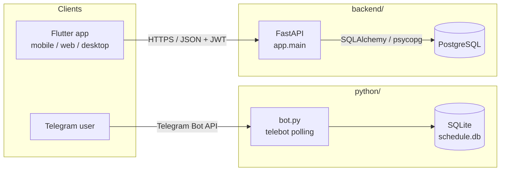
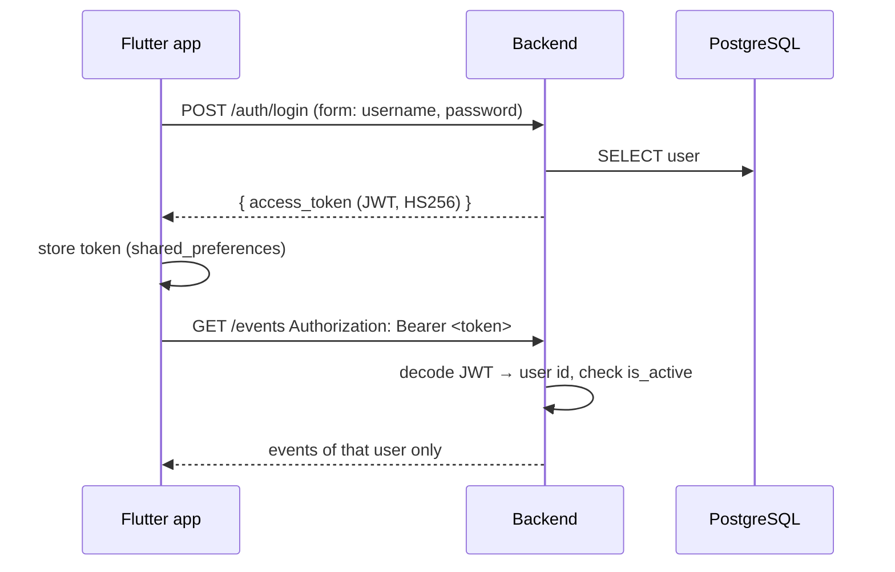

# Architecture

The repository holds three independent parts. Each has its own Dockerfile and
`docker-compose.yml`, so each can be built and deployed on its own.

```
shedule-manager/
├── python/    Telegram bot (original project): pyTelegramBotAPI + SQLite
├── backend/   REST API for the Flutter app: FastAPI + SQLAlchemy + PostgreSQL
├── flutter/   Cross-platform UI client (Android, iOS, Web, Linux)
└── docs/      This documentation
```

## Component diagram



The Telegram bot and the backend **do not share data**: the bot keeps its own
SQLite file and authorizes Telegram users with a single shared password, while
the backend has real per-user accounts. The Flutter app is a feature-equivalent
graphical version of the bot that talks only to the backend.

## Feature parity (bot → app)

| Telegram bot | Flutter app | Backend endpoint |
|---|---|---|
| password gate | login / register screen | `POST /auth/login`, `POST /auth/register` |
| `/add` wizard | *New event* form (repeat: none/daily/weekly/every N; 4/8/12/custom/∞) | `POST /events` |
| `/schedule [date]` | *Day* tab | `GET /events?start=` |
| `/free [date]` | *Free time* chips on the Day tab | `GET /events/free?day=` |
| `/week [date]` | *Week* tab → *Plans* | `GET /events/week?start=` |
| — | *Week* tab → *Free time* (per day, with daily total) | `GET /events/free/week?start=` |
| `/edit` | tap an event | `PATCH /events/{id}` |
| `/delete` (one / whole series) | delete icon → dialog | `DELETE /events/{id}`, `DELETE /events/series/{sid}` |
| `/settings`, `/travel_time`, `/working_hours` | *Settings* tab | `GET/PATCH /settings` |
| — | *Manage users* (superuser) | `/admin/users` |

## Backend layers

```
HTTP request
   │
   ▼
routers/*.py        ← endpoint functions, input validated by schemas.py
   │  Depends(get_current_user)  ← deps.py + security.py (JWT)
   ▼
scheduling.py       ← domain logic: series creation, infinite-series extension, free slots
   │
   ▼
models.py / database.py  ← SQLAlchemy ORM + session per request
   │
   ▼
PostgreSQL
```

- **Config** comes from environment variables (`config.py`, pydantic-settings).
- **Startup** (`main.py` lifespan): create tables, then `bootstrap.ensure_superuser`.
- **Schema management**: `Base.metadata.create_all` on startup. This is fine
  while the schema is young; switch to Alembic once you need migrations of
  existing data.

## Key domain rules

These are shared by the bot (`python/utils.py`, `python/database.py`) and the
backend (`backend/app/scheduling.py`):

1. **Per-event travel time.** After an event with `needs_travel_time = true`,
   `travel_time_minutes` from the user's settings is blocked before time counts
   as free again.
2. **Working day across midnight.** If `day_end <= day_start` (e.g. 06:30–01:00),
   the day ends on the next calendar day.
3. **Series.** Repeated events are stored as one row per occurrence, linked by
   `series_id`. Editing changes one occurrence; deleting offers one or all.
4. **Infinite series.** Rows are materialized 90 days ahead on creation. Any
   read that reaches past the last materialized row extends the series up to
   the requested date plus a 30-day buffer. Deleting the series stops this.

## Authentication flow



See [accounts.md](accounts.md) for details.
