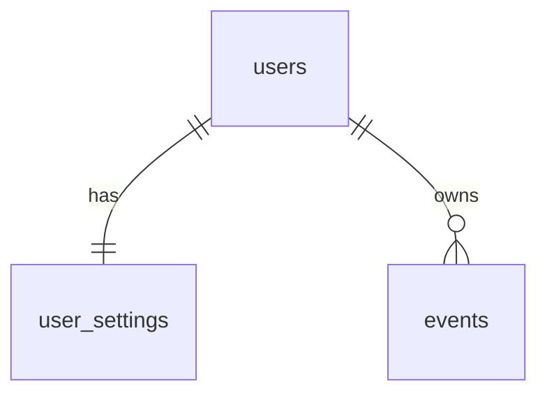

# Database

## Backend — PostgreSQL

Tables are created by SQLAlchemy on startup (`app/database.py:init_db`).

### `users`

| Column | Type | Notes |
|---|---|---|
| `id` | serial PK | |
| `username` | varchar(64), unique, indexed | `[A-Za-z0-9_.-]`, 3–64 chars |
| `password_hash` | varchar(128) | bcrypt |
| `is_active` | boolean | disabled users can't log in; their tokens stop working |
| `is_superuser` | boolean | access to `/admin/*` |
| `created_at` | timestamptz | |

### `user_settings` (1:1 with users)

| Column | Type | Default |
|---|---|---|
| `user_id` | PK, FK → users.id ON DELETE CASCADE | |
| `travel_time_minutes` | integer | 30 |
| `day_start` | varchar(5) `HH:MM` | `08:00` |
| `day_end` | varchar(5) `HH:MM` | `23:00` |

### `events`

| Column | Type | Notes |
|---|---|---|
| `id` | serial PK | |
| `user_id` | FK → users.id ON DELETE CASCADE, indexed | owner |
| `title` | varchar(255) | |
| `date` | date, indexed | |
| `start_time` | varchar(5) `HH:MM` | |
| `duration_minutes` | integer | 1..1440 |
| `needs_travel_time` | boolean | add travel buffer after this event (API default: false) |
| `series_id` | varchar(32), nullable, indexed | uuid4 hex shared by all occurrences |
| `repeat_type` | varchar(16), nullable | `daily` / `weekly` / `custom` / `weekdays` / `weekends` / `cycle` |
| `repeat_interval_days` | integer, nullable | step between occurrences (daily/weekly/custom) |
| `repeat_days_on` | integer, nullable | cycle: days with the event (5 in 5:2) — *migration 001* |
| `repeat_days_off` | integer, nullable | cycle: days without it (2 in 5:2) — *migration 001* |
| `series_start` | date, nullable | anchor the pattern is counted from — *migration 001* |
| `series_infinite` | boolean | series is auto-extended on read |
| `created_at` | timestamptz | |

Schema changes to existing databases: see [migrations.md](migrations.md).

## Telegram bot — SQLite (`python/schedule.db`)

- `events` — same columns as above, but `user_id` is the Telegram user id and
  booleans are stored as 0/1, dates/times as text.
- `settings` — `user_id`, `travel_time_minutes`, `day_start`, `day_end`,
  `is_authorized` (passed the password gate).

The bot migrates older databases by adding missing columns at startup
(`python/database.py:init_db`).
